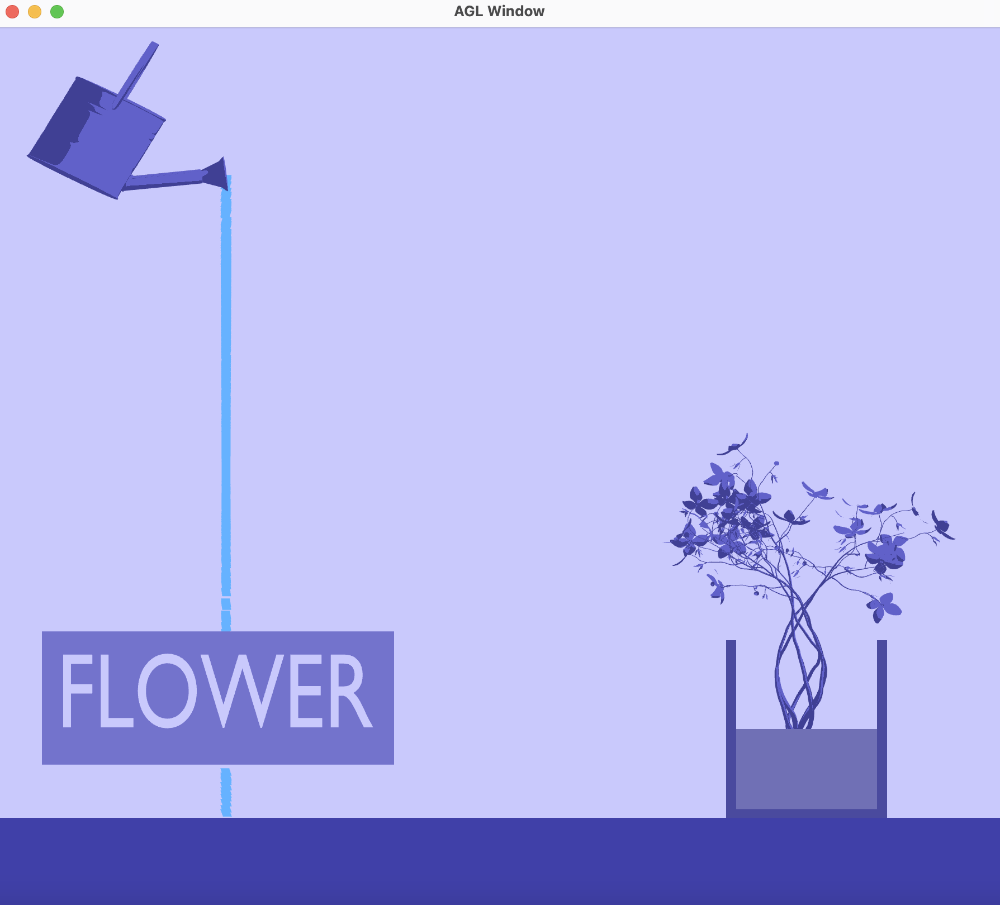

# FLOWER

This project, titled flower, allows for the user to interact with the window 
interface by using the mouse to draw a path/line. The goal here is to lead the
water droplets from the watering can to the flower pot/vase in order to
water the flower. The title of the mini game at the bottom left of the screen,
"FLOWER", as a visual detailing.

The game generates a watering can (at the top left corner of the screen), a vase
with flowers and soil (at the bottom right corner of the screen), and the title
card (at the bottom left of the screen). Water particles fall from the watering
can as soon as the program is run. The user then draws a path/ramp anywhere on
the screen where there is open space and leads the water droplets from the
watering can to the flower vase. The water flows down the drawn path and, hopefully
based on the path drawn, fills the vase.



## How the program works
**The background:**
The program uses different elements to draw the scene, such as the water can,
flower, and cube (for the ground) ply files. The rest of the objects within the
screen are created through the maniupulation of the cube and sphere objects (the
the vase with the soil and varying water levels are created using a combination
of cubes). These objects are then paired with their respective shaders (designated
based on personal stylistic choice) in order to colorize the game into a purple
monochrome-ish color scheme. This simple monochrome design was used to emulate
the vibes within flat (pixel) games. A slight influence of "pixels" was used as
I have always been interested in pixel games along with my other interest of
flowers and the flow of water. Hence the water droplets' pixel-like form. This
program is specifically unique from existing demos as it combines user interaction
with particle manipulation and it builds on top of the mechanics of current games
with my interests.
This game also build on top of the current materials as it combines and
builds on top of the blobilism, pixmaps, and particles assignments.

The program incorporates blobilism as it allows the user to draw on the screen a
path from the watering can to the flowers. Pixmaps has a slight inflluence as the
areas of the window are triangulated to locate the vase of the flowers where the
water droplets should go in. Particles is used to create the stream of water which
is then repeated once it hits either the ground, outside the visible screen,
or the inside of the flower vase.

**The mechanics:**
The main functions of this mini-game is for the user to draw a path on the screen
and have the particles interact with the drawn path. If the user's drawn path
allows the particles to get inside the vase, then the water level within the vase
rises slowly according to a certain amount of droplets. The water level stops
rising once it fills to the top of the vase even if water particles continue to
enter inside the vase. If the user clicks the 'c' key on their keyboard, the path
the user drew is cleared from the screen. If the user clicks 'r' on their keyboard,
the water level no matter how high it is within the vase resets so that the vase
is empty and no water can be seen. (This resetting of the water level allows for
the user to redraaw their path and satisfyingly see the vase fill up over and over
again).

Understanding the basic functionality of the game, the math within this program
mostly occurs when calculating the flow of the water droplet/particles and their
interaction with the user's drawn path. First, the basic math occurs when allowing
the user to draw on the screen. A type is created to hold what the user draws;
within this program, I made every point the user draws for the path/line to be a
circle with its type specified as drawCircle:
```
class drawCircle {
  public:
    double size = 0.1;
    rgb rgbColors;
    float xCoord, yCoord;
};
```
A vector, circleVector of type drawCircle, is created to hold all the circles the
user draws. When drawing the circles onto the screen, it is done within the draw()
function by going through all the drawCircles in the circleVector using a for loop.
Due to the window's width and height (x: 0 to 600 and y: 0 to 600) being different
from the orthographic projection's set width and height (x: -5 to 5 and y: -5 to 5),
math is used to convert the window version to the orthographic view limits. For example,
to convert the known x location of the window version to the orthographic projection
limits, I did: x (known) / width() = n (unknown) / 10 (since -5 to 5 is a distance
of 10). Using this, I was able to derive an equation to find the unknown value of
n by pushing all the known variables to one side:
n (unknown) = x (known) / width() * 10. However, since the width and heights start
from -5, I then subtracted 5 from the equation, so then the drawn circle's
coordinates are based off of the equation:
n (unknown) = x (known) / width() * 10 - 5, as seen in the code:
```
newCircle.xCoord = ((x / (float)width()) * halfWidth * 2) - halfWidth;
float newY = height() - y;
newCircle.yCoord = ((newY / (float)height()) * halfHeight * 2) - halfHeight;
```

Now for the portion where the water particles interact with the drawn path, this
was all performed and calculated with the particles' updateWaterDroplets() function.
For every particle, first the force (a vec3 value) is calculated where gravity is
taken into account. Since I am first creating the force without the particle's
interaction with the drawn path, only the y value is affected (gravity) while the
x and z value are both zero. Then a for loop that goes through all the drawn
circles in the path is created to check for collision. Collision is checked based
on how close the particle is to the drawn circle. So the distance between the two
objects is calculated using the glm::distance() function:
```
glm::distance(circPos, particle.pos) < 0.3
```
Due to the drawn circle/path having a certain radius, that means the distance
should be about 0.3 to account for the drawn circle's size. This is since if
instead the location of the drawn circle and the particle was used to check for
collision or the 0.3 value was instead 0, then the particle would run into the
drawn path rather than sliding on top of it. The value of 0.3, allows for this
"sliding on top" to be accounted for. Once the program knows the water particle
is on top of the drawn circle, then the next drawn circle in the vector is looked
at to calculate in which direction the water particle should flow. The direction
is found by subtracting the next drawn circle by the current drawn circle (since
subtracting two points gives a vector) and normalizing it. This direction is then
multiplied with a force of 0.01 to create a sideways force value:
```
if (lengthCirc > 0.0001) {
    vec3 direction = normalize(nextCircPos - circPos);
    force += direction * 0.01f; // 0.01 sideways force
}
```
Then the length of the vector from the particle position to the drawn circle is
found to then recalculate the force accordingly. This allows for all the
components--the water, particle, the drawn circle, the next circle (to check if
the path continues)--to be taken into consideration. Then the particle's
velocity is updated based on the calculated force and the time passed. And the
particle's position is updated with the new velocity and the time passed:
```
particle.vel += force * dt;
particle.pos += dt * particle.vel;
```
If the water droplet reaches the ground (or outside the visible screen) then it
"dies" and respawns at the start of the watering can's spout. If it reaches the
vase then it collects up into vase until about ~20-50 particles are collected
then an object known as the water level rises to act as if the vase is being
filled with water. After the object rises to the height of the vase it then stops
filling up the vase even if more water particles come in. The collection of the
particles and knowing when to raise the water level is calculated within the
updateWaterDroplets() and drawWaterLevel() functions.
The updateWaterDroplets() counts how many water particles enter the vase:
```
if ((particle.pos.x >= 2.26 && particle.pos.x <= 3.78) && 
    (particle.pos.y <= waterLevel)) {
    particlesInVase++;
    particle.pos = spoutPos;
    float rVelY = randomize(-0.4, 0.2);
    particle.vel = vec3(0, rVelY, 0);
}
```
The if statements checking if the water droplet is within the bounds of the vase
and then incrementing the number of particlesInVase by one and then letting the
particle "die" and respawn at the spout.
A small bit of math comes in again when checking for when to raise the water level.
To keep the water level from rising to rapidly, I deciding to using modulo (%) to
check if the particlesInVase variable had a certain remainder. I, personally,
decided to make two modulo statements due to visual, stylistic reasons (as I
liked how the water would rise with these two modulo statements):
```
(particlesInVase % 100 == 10) || (particlesInVase % 100 == 50)
```
By checking if the waterLevel was also less than the vase's height I was able to
achieve this water rising effect without having to make the flower pot overflow.
Along with this, I noticed that the water particles were able to pass through the
vase's walls, in order to solve this bug and create a more realistic effect, I
created boundaries using the vase's left and right walls' x coordiante/position
values. I then readjusted the water particle's velocity to zero its x-value so
that it would only move downward (rVelY):
```
// If it hits the inside of the vase's right wall, the water particle drops down,
// instead of continuing to shoot outside the vase
if (particle.pos.x <= 3.78 && particle.pos.x >= 3.75 && particle.pos.y <= -1.93) {
    float rVelY = randomize(-0.4, 0.2);
    particle.vel = vec3(0, rVelY, 0);
}

// If it hits outside the vase's left wall, the water particle drops down,
// instead of continuing to shoot into the vase
if (particle.pos.x <= 2.26 && particle.pos.x >= 2.23 && particle.pos.y <= -1.93) {
    float rVelY = randomize(-0.4, 0.2);
    particle.vel = vec3(0, rVelY, 0);
}
```
This allowed for the program to have a nice visual of a water particle to seemingly
hit the side of the vase's wall and then stick a bit and slide down the wall slowly
(an awesome more realistic effect).

## How to build

*Windows*

Open git bash to the directory containing this repository.

```
flower $ mkdir build
flower $ cd build
flower/build $ cmake ..
flower/build $ start flower.sln
```

Your solution file should contain four projects.
To run from the git bash command shell, 

```
flower/build $ ../bin/Debug/demo.exe
```

*macOS*

Open terminal to the directory containing this repository.

```
flower $ mkdir build
flower $ cd build
flower/build $ cmake ..
flower/build $ make
```

To run each program from build, you would type

```
flower/build $ ../bin/demo
```

## Demo of basic and unique features
1. Path to vase:


2. Path in opposite direction - shows how particles interact with path in different
directions:


3. C-key function - shows what happens when the c key is pressed (the drawn path
is cleared from the screen):


4. R-key function - shows what happens when the r key is pressed (the water in
the flower case disappears/resets):


5. Everything together - shows everything working together, mostly to show how
even when the r key is pressed if the drawn path leads to the flower vase, the
vase still refills up with water:
